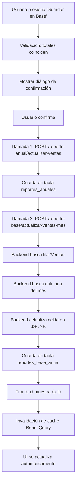

# ✅ Implementación Completada: Botón "Guardar en Base"

**Fecha:** 23 de Octubre, 2025  
**Estado:** ✅ IMPLEMENTADO

---

## 🎯 Objetivo Cumplido

El botón "Guardar en Base" ahora guarda el **Subtotal MXN de Mi Admin** en **DOS lugares**:

1. ✅ **Tabla `reportes_anuales`** (resumen/comparación)
2. ✅ **Excel en `reportes_base_anual`** (fila "Ventas", columna del mes)

---

## 📋 Cambios Realizados

### 🔧 Backend

#### 1. **Servicio:** `trabajos.service.ts`

**Nuevo método:** `actualizarVentasMensualesEnExcel()`

```typescript
async actualizarVentasMensualesEnExcel(
    trabajoId: string,
    mes: number,
    ventas: number,
    currentUser: CurrentUserPayload,
): Promise<ReporteBaseAnual>
```

**Funcionalidad:**

- ✅ Obtiene el Reporte Base Anual del trabajo
- ✅ Busca la fila de encabezado con los meses
- ✅ Identifica la columna del mes específico (ENERO, FEBRERO, etc.)
- ✅ Busca la fila "( = ) Ventas"
- ✅ Actualiza la celda en la intersección
- ✅ Guarda los cambios en la base de datos (JSONB)

**Archivo:** `backend/src/trabajos/services/trabajos.service.ts`  
**Líneas:** ~647-800 (nuevo método agregado al final)

---

#### 2. **Controller:** `trabajos.controller.ts`

**Nuevo endpoint:**

```typescript
POST /trabajos/:id/reporte-base/actualizar-ventas-mes
Body: { mes: number; ventas: number }
Roles: ADMIN, GESTOR, MIEMBRO
```

**Archivo:** `backend/src/trabajos/controllers/trabajos.controller.ts`

---

### 🎨 Frontend

#### 3. **Servicio API:** `trabajos.service.ts`

**Nuevo método:**

```typescript
async actualizarVentasMensualesEnExcel(
    trabajoId: string,
    mes: number,
    ventas: number
): Promise<ReporteBaseAnual>
```

**Archivo:** `frontend/src/services/trabajos.service.ts`

---

#### 4. **Hook React Query:** `useReporteAnualUpdate.ts`

**Nuevo hook:** `useReporteBaseAnualUpdate()`

```typescript
export const useReporteBaseAnualUpdate = ({
    trabajoId,
    onSuccess,
    onError,
}: UseReporteBaseAnualUpdateProps)
```

**Retorna:**

- `actualizarVentasEnExcel()` - Función para llamar la mutación
- `isLoading`, `isSuccess`, `isError`, `error` - Estados de la mutación

**Archivo:** `frontend/src/features/trabajos/reportes/reporte-anual/hooks/useReporteAnualUpdate.ts`

---

#### 5. **Componente:** `GuardarEnBaseButton.tsx`

**Cambios principales:**

1. ✅ Importa ambos hooks:

   - `useReporteAnualUpdate` (tabla resumen)
   - `useReporteBaseAnualUpdate` (Excel)

2. ✅ Función `handleConfirm()` modificada:

   ```typescript
   const handleConfirm = async () => {
     // 1. Guardar en tabla reportes_anuales
     actualizarVentas({
       anio,
       mes,
       ventas,
       ventasAuxiliar,
     });

     // 2. Guardar en Excel
     actualizarVentasEnExcel({
       mes,
       ventas,
     });
   };
   ```

3. ✅ Mensajes de confirmación actualizados:
   - Indica que guardará en ambos lugares
   - Muestra éxito detallado

**Archivo:** `frontend/src/features/trabajos/reportes/reporte-anual/components/GuardarEnBaseButton.tsx`

---

## 🔍 Flujo Completo

### Cuando el usuario presiona "Guardar en Base":



---

## 🗄️ Tablas Actualizadas

### 1. **`reportes_anuales`** (Vista de resumen)

```sql
UPDATE reportes_anuales
SET ventas = ?,
    ventas_auxiliar = ?,
    diferencia = ?,
    confirmado = ?
WHERE trabajo_id = ? AND anio = ? AND mes = ?
```

**Campos actualizados:**

- `ventas`: Total de Mi Admin
- `ventas_auxiliar`: Total del Auxiliar
- `diferencia`: |ventas - ventasAuxiliar|
- `confirmado`: true si diferencia < 0.10

---

### 2. **`reportes_base_anual`** (Excel en JSONB)

```sql
UPDATE reportes_base_anual
SET hojas = ?,  -- JSONB actualizado
    ultima_actualizacion = NOW()
WHERE trabajo_id = ?
```

**Estructura actualizada en JSONB:**

```json
{
  "hojas": [
    {
      "nombre": "Hoja1",
      "datos": [
        ["OP'N.", "CONCEPTO", "ENERO", "FEBRERO", "..."],
        ["( = )", "Ventas", 150000, 180000, "..."], // ← Celda actualizada
        ["...", "...", "..."]
      ]
    }
  ]
}
```

---

## 📝 Algoritmo de Búsqueda en Excel

El backend implementa un algoritmo robusto para encontrar la celda correcta:

### 1. **Buscar fila de encabezado**

```typescript
// Busca en las primeras 20 filas
// Identifica la fila que contiene al menos 3 nombres de meses
const headerRowIndex = datos.findIndex((row) => {
  const mesesEncontrados = ['enero', 'febrero', ...].filter(
    m => rowText.includes(m)
  ).length;
  return mesesEncontrados >= 3;
});
```

### 2. **Buscar columna del mes**

```typescript
const mesNombre = mesesNombres[mes - 1]; // "enero", "febrero", etc.
const mesColumnIndex = headerRow.findIndex(
  (cell) => normalize(cell) === mesNombre
);
```

### 3. **Buscar fila "Ventas"**

```typescript
// Busca después del encabezado
// Verifica columna CONCEPTO (índice 1) y símbolo "=" (índice 0)
const ventasRowIndex = datos.findIndex((row) => {
  const concepto = normalize(row[1]);
  const simbolo = normalize(row[0]);
  return concepto.includes("ventas") && simbolo.includes("=");
});
```

### 4. **Actualizar celda**

```typescript
datos[ventasRowIndex][mesColumnIndex] = ventas;
```

---

## ✅ Validaciones Implementadas

### Backend:

- ✅ Mes válido (1-12)
- ✅ Trabajo existe
- ✅ Reporte Base Anual existe
- ✅ Excel tiene al menos una hoja
- ✅ Fila de encabezado encontrada
- ✅ Columna del mes encontrada
- ✅ Fila "Ventas" encontrada

### Frontend:

- ✅ Totales disponibles (Auxiliar procesado)
- ✅ Totales coinciden (diferencia < $0.10)
- ✅ No hay cambios sin guardar
- ✅ Diálogo de confirmación antes de guardar

---

## 🧪 Cómo Probar

### Requisitos previos:

1. ✅ Tener un trabajo creado
2. ✅ Importar el Reporte Base Anual (Excel)
3. ✅ Crear un mes en el trabajo
4. ✅ Importar y procesar el Reporte MI Admin
5. ✅ Importar y procesar el Auxiliar de Ingresos

### Pasos de prueba:

1. **Navegar a un mes del trabajo**

   ```
   /trabajos/:trabajoId/mes/:mesNumero
   ```

2. **Abrir el Reporte MI Admin**

   - Click en pestaña "MI Admin"

3. **Verificar que aparezca el botón "Guardar en Base"**

   - Solo visible si totales coinciden (diferencia < $0.10)

4. **Presionar "Guardar en Base"**

   - Aparece diálogo de confirmación
   - Muestra año, mes, totales y diferencia

5. **Confirmar guardado**

   - Se ejecutan ambas llamadas
   - Aparece mensaje de éxito detallado

6. **Verificar resultado:**

   **a) En la vista de Reporte Anual:**

   ```
   /trabajos/:trabajoId/reporte-anual/:anio
   ```

   - Verificar que el mes aparece como "✅ Confirmado"
   - Validar que los totales se muestran correctamente

   **b) En el Excel (Reporte Base Anual):**

   ```
   /trabajos/:trabajoId/reporte-base-anual
   ```

   - Abrir el Excel importado
   - Verificar que en la fila "( = ) Ventas"
   - En la columna del mes correspondiente
   - Aparece el valor del Subtotal MXN

---

## 🐛 Manejo de Errores

### Errores del Backend:

1. **Trabajo no encontrado**

   ```
   404: Trabajo con ID {id} no encontrado
   ```

2. **Reporte Base Anual no encontrado**

   ```
   404: Reporte Base Anual no encontrado. Debe importar el Excel primero.
   ```

3. **Estructura del Excel incorrecta**
   ```
   400: No se encontró la fila de encabezado con los nombres de los meses
   400: No se encontró la columna del mes "ENERO"
   400: No se encontró la fila "( = ) Ventas" en la hoja
   ```

### Errores del Frontend:

- ❌ Se muestran en el diálogo de confirmación
- 🔄 Se permite reintentar
- 📊 Se mantiene el estado de guardado parcial

---

## 🎨 UI/UX Mejorada

### Tooltip:

```
"Guardar totales en Reporte Anual y actualizar Excel"
```

### Diálogo de confirmación:

```
Se guardarán los totales mensuales en:
• Tabla de resumen anual (reportes_anuales)
• Excel del Reporte Base Anual (fila Ventas)
```

### Mensaje de éxito:

```
✅ Éxito: Totales guardados correctamente
• Tabla de resumen actualizada
• Excel actualizado (fila Ventas, columna octubre)
```

---

## 📊 Invalidación de Cache (React Query)

Después de guardar exitosamente, se invalidan las siguientes queries:

### Después de guardar en `reportes_anuales`:

```typescript
queryClient.invalidateQueries(["reporte-anual", trabajoId, anio]);
queryClient.invalidateQueries(["reporte-anual-resumen", trabajoId, anio]);
queryClient.invalidateQueries(["reporte-mensual", trabajoId, anio, mes]);
```

### Después de guardar en `reportes_base_anual`:

```typescript
queryClient.invalidateQueries(["trabajo", trabajoId]);
queryClient.invalidateQueries(["reporte-base-anual", trabajoId]);
```

---

## 🔒 Permisos

**Roles permitidos:**

- ✅ ADMIN
- ✅ GESTOR
- ✅ MIEMBRO

**El usuario debe tener permisos de gestión sobre el trabajo.**

---

## 📚 Archivos Modificados

### Backend (2 archivos):

1. `backend/src/trabajos/services/trabajos.service.ts` (+170 líneas)
2. `backend/src/trabajos/controllers/trabajos.controller.ts` (+17 líneas)

### Frontend (3 archivos):

1. `frontend/src/services/trabajos.service.ts` (+10 líneas)
2. `frontend/src/features/trabajos/reportes/reporte-anual/hooks/useReporteAnualUpdate.ts` (+65 líneas)
3. `frontend/src/features/trabajos/reportes/reporte-anual/components/GuardarEnBaseButton.tsx` (~50 líneas modificadas)

---

## ✅ Checklist de Implementación

- [x] Backend: Método de servicio para actualizar Excel
- [x] Backend: Endpoint en controller
- [x] Backend: Validaciones de mes, trabajo, Excel
- [x] Backend: Algoritmo de búsqueda robusto
- [x] Backend: Manejo de errores descriptivos
- [x] Frontend: Servicio API
- [x] Frontend: Hook React Query
- [x] Frontend: Actualización del componente GuardarEnBaseButton
- [x] Frontend: Mensajes de confirmación mejorados
- [x] Frontend: Manejo de estados de carga
- [x] Frontend: Invalidación de cache
- [ ] Testing manual
- [ ] Documentación de usuario

---

## 🚀 Próximos Pasos

1. **Probar en ambiente de desarrollo:**

   - Verificar que ambas tablas se actualicen correctamente
   - Validar el Excel se modifique en la celda correcta
   - Confirmar mensajes de éxito/error

2. **Optimización futura (opcional):**

   - Agregar logs más detallados
   - Implementar transacciones para rollback
   - Agregar tests unitarios y de integración

3. **Documentación de usuario:**
   - Agregar guía paso a paso con screenshots
   - Crear video tutorial

---

## 🎉 Resultado Final

El botón "Guardar en Base" ahora cumple completamente con el requisito:

✅ **Guarda el Subtotal MXN de Mi Admin en:**

- Tabla de resumen (`reportes_anuales`)
- Excel importado (`reportes_base_anual`)
  - **Fila:** `( = ) Ventas`
  - **Columna:** Mes correspondiente (ENERO, FEBRERO, etc.)

🎊 **Implementación completada exitosamente!**
