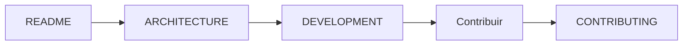
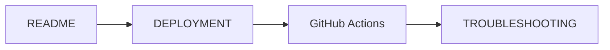
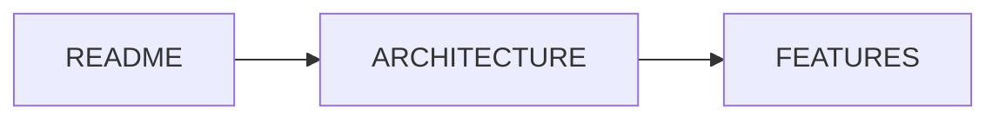

# 📚 Documentación - Sistema de Gestión de Trabajos Contables V2

**Versión**: 1.1.0
**Fecha**: 27/12/2025
**Estado**: ✅ Producción

---

## 🎯 Índice de Documentación

Esta es la documentación completa del proyecto. Aquí encontrarás toda la información que necesitas para entender, desarrollar, hacer deploy y solucionar problemas del sistema.

---

## 📖 Guías Rápidas

### Para Empezar

| Guía | Descripción | Tiempo de Lectura |
|------|-------------|-------------------|
| **[README Principal](../README.md)** | Vista general, inicio rápido, características | 5 min |
| **[Desarrollo](DEVELOPMENT.md)** | Setup local, stack, comandos de desarrollo | 10 min |
| **[Deployment](DEPLOYMENT.md)** | Deployment completo a VPS o local | 15 min |

### Arquitectura y Funcionalidad

| Documento | Descripción | Para... |
|-----------|-------------|---------|
| **[Arquitectura](ARCHITECTURE.md)** | Diagramas, stack, base de datos, API | Entender el sistema |
| **[Features](FEATURES.md)** | Lista completa de funcionalidades | Qué hace el sistema |
| **[Contributing](CONTRIBUTING.md)** | Guía de contribución | Cómo contribuir |

### Solución de Problemas

| Documento | Descripción | Para... |
|-----------|-------------|---------|
| **[Troubleshooting](TROUBLESHOOTING.md)** | Problemas comunes y soluciones | Debugging, errors |
| **[Changelog](CHANGELOG.md)** | Historial de cambios | Versiones, features |

### Agentes (Claude Code)

| Documento | Descripción | Para... |
|-----------|-------------|---------|
| **[Agents](AGENTS.md)** | Sistema de agentes especializados | Desarrollo con AI |

---

## 🚀 Inicio Rápido

### Nuevo en el proyecto?

1. **Leer el [README principal](../README.md)** - 5 min
   - Entender qué es el proyecto
   - Iniciarlo localmente con Docker

2. **Leer [Arquitectura](ARCHITECTURE.md)** - 10 min
   - Entender la estructura del sistema
   - Conocer el stack tecnológico

3. **Seguir [Guía de Desarrollo](DEVELOPMENT.md)** - 10 min
   - Configurar entorno de desarrollo
   - Aprender comandos útiles

### ¿Necesitas hacer deployment?

Lee **[Deployment Guide](DEPLOYMENT.md)** - 15 min
- Deployment a VPS con Plesk
- Configuración de dominios
- Scripts automáticos

### ¿Tienes problemas?

Consulta **[Troubleshooting](TROUBLESHOOTING.md)** - 5 min
- Diagnóstico rápido
- Soluciones a problemas comunes

---

## 📁 Estructura de Documentación

```
docs/
├── README.md                       # Este archivo - Índice
├── DEVELOPMENT.md                   # Guía de desarrollo
├── ARCHITECTURE.md                  # Arquitectura técnica
├── DEPLOYMENT.md                    # Guía de deployment
├── FEATURES.md                      # Lista de funcionalidades
├── TROUBLESHOOTING.md               # Solución de problemas
├── CHANGELOG.md                     # Historial de cambios
├── CONTRIBUTING.md                  # Guía de contribución
├── AGENTS.md                        # Sistema de agentes Claude Code
└── deployment/
    └── DEPLOYMENT-GITHUB-ACTIONS.md # Deployment con GitHub Actions
```

---

## 🗂️ Por Tema

### Desarrollo

- **[DEVELOPMENT.md](DEVELOPMENT.md)** - Setup, comandos, estructura
- **[ARCHITECTURE.md](ARCHITECTURE.md)** - Diagramas, base de datos, API
- **[CONTRIBUTING.md](CONTRIBUTING.md)** - Cómo contribuir

### Deployment

- **[DEPLOYMENT.md](DEPLOYMENT.md)** - Deployment completo
- **[deployment/DEPLOYMENT-GITHUB-ACTIONS.md](deployment/DEPLOYMENT-GITHUB-ACTIONS.md)** - CI/CD con GitHub Actions

### Operaciones

- **[TROUBLESHOOTING.md](TROUBLESHOOTING.md)** - Solución de problemas
- **[CHANGELOG.md](CHANGELOG.md)** - Historial de versiones

### Información

- **[FEATURES.md](FEATURES.md)** - Características completas
- **[AGENTS.md](AGENTS.md)** - Sistema de agentes AI

---

## 🎯 Flujos de Trabajo Comunes

### Como Desarrollador



### Como DevOps



### Para Entender el Sistema



---

## 📊 Stack Tecnológico

### Backend

```
NestJS 10.3 + TypeORM 0.3.20 + PostgreSQL 15
├── JWT Authentication
├── ExcelJS 4.0 (Excel import)
├── Class-validator (validation)
└── Bcrypt (password hashing)
```

### Frontend

```
React 18 + Vite 5.4 + TypeScript
├── React Router DOM 6.21
├── TanStack Query 5.90
├── Tailwind CSS 3.4
└── Lucide React Icons
```

---

## 🔗 Links Rápidos

- **Repositorio**: https://github.com/tiagofur/aegg-new-app
- **Producción Frontend**: https://aegg.creapolis.mx
- **Producción Backend**: https://aegg-api.creapolis.mx
- **Documentación Claude Code**: [CLAUDE.md](../CLAUDE.md)

---

## 💡 Consejos de Uso

1. **Primera vez**: Empieza con el [README principal](../README.md)
2. **Para desarrollar**: Lee [DEVELOPMENT.md](DEVELOPMENT.md) y [ARCHITECTURE.md](ARCHITECTURE.md)
3. **Para deploy**: Lee [DEPLOYMENT.md](DEPLOYMENT.md)
4. **Para problemas**: Ve directo a [TROUBLESHOOTING.md](TROUBLESHOOTING.md)
5. **Para contribuir**: Lee [CONTRIBUTING.md](CONTRIBUTING.md)

---

## 📝 Notas

- Toda la documentación está en español
- La documentación se mantiene actualizada con cada release
- Para sugerencias o correcciones, abre un issue o PR

---

**Última actualización**: 27/12/2025
**Versión**: 1.1.0
**Mantenido por**: [Tiago Furquim](https://github.com/tiagofur)
