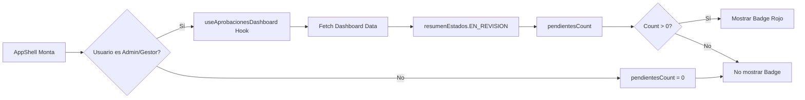

# 📋 Implementación Tarea 2.3: Badge de Pendientes en el Menú

**Fecha:** 25 de octubre de 2025  
**Tarea:** Fase 2 - UX - Badge con contador de pendientes en navegación  
**Estado:** ✅ Completada

---

## 🎯 Objetivo

Agregar un badge visual con el número de trabajos pendientes de revisión en el menú de navegación, tanto en versión desktop como móvil, para que los gestores tengan visibilidad constante de las revisiones pendientes.

---

## 📝 Cambios Implementados

### 1. Importaciones Necesarias

**Archivo:** `frontend/src/components/layout/AppShell.tsx`

**Nuevas importaciones:**

```typescript
import { ShieldCheck } from "lucide-react"; // Ícono para Aprobaciones
import { useAprobacionesDashboard } from "../../features/trabajos/aprobaciones";
```

---

### 2. Nuevo Link de "Aprobaciones" en el Menú

**Archivo:** `frontend/src/components/layout/AppShell.tsx`

**Ubicación:** Array `navLinks`

```typescript
const navLinks: NavLinkItem[] = [
  { to: "/dashboard", label: "Inicio", icon: Home },
  { to: "/trabajos", label: "Trabajos", icon: SquareKanban },
  {
    to: "/trabajos/aprobaciones", // ⬅️ NUEVO
    label: "Aprobaciones",
    icon: ShieldCheck,
    roles: ["Admin", "Gestor"],
  },
  {
    to: "/clientes",
    label: "Clientes",
    icon: Building2,
    roles: ["Admin", "Gestor"],
  },
  {
    to: "/admin/users",
    label: "Usuarios",
    icon: Users,
    roles: ["Admin"],
  },
];
```

**Características:**

- ✅ Ícono `ShieldCheck` (escudo con check) apropiado para aprobaciones
- ✅ Solo visible para roles `Admin` y `Gestor`
- ✅ Ruta `/trabajos/aprobaciones` correcta

---

### 3. Hook para Obtener Contador de Pendientes

**Archivo:** `frontend/src/components/layout/AppShell.tsx`

**Ubicación:** Dentro del componente `AppShell`, después de la inicialización de `role`

```typescript
// Hook para obtener el contador de aprobaciones pendientes (solo para Admins y Gestores)
const shouldFetchAprobaciones = role === "Admin" || role === "Gestor";
const { data: aprobacionesData } = useAprobacionesDashboard();
const pendientesCount = shouldFetchAprobaciones
  ? aprobacionesData?.resumenEstados?.EN_REVISION || 0
  : 0;
```

**Lógica:**

- 🔍 Hook `useAprobacionesDashboard()` se ejecuta siempre (no tiene opción `enabled`)
- ✅ Solo se usa el conteo si el usuario es `Admin` o `Gestor`
- 0️⃣ Para otros roles, `pendientesCount` es 0 (no se muestra badge)
- 📊 Extrae el conteo de `resumenEstados.EN_REVISION`

---

### 4. Badge en Menú Desktop

**Archivo:** `frontend/src/components/layout/AppShell.tsx`

**Ubicación:** Dentro del `<nav>` desktop (`.hidden.md:flex`)

```tsx
<nav className="hidden md:flex items-center gap-1">
  {availableLinks.map(({ to, label, icon: Icon }) => {
    const active = location.pathname.startsWith(to);
    const isAprobaciones = to === "/trabajos/aprobaciones";
    const showBadge = isAprobaciones && pendientesCount > 0;

    return (
      <NavLink
        key={to}
        to={to}
        className={({ isActive }) =>
          cn(
            "flex items-center gap-2 rounded-lg px-3 py-2 text-sm font-medium transition-colors relative",
            (isActive || active) && "bg-blue-50 text-blue-600",
            !(isActive || active) &&
              "text-slate-600 hover:bg-slate-100 hover:text-slate-900"
          )
        }
      >
        <Icon className="h-4 w-4" />
        {label}
        {showBadge && (
          <span className="ml-auto inline-flex h-5 min-w-[1.25rem] items-center justify-center rounded-full bg-rose-500 px-1.5 text-xs font-bold text-white shadow-sm">
            {pendientesCount}
          </span>
        )}
      </NavLink>
    );
  })}
</nav>
```

**Características del Badge Desktop:**

- 🔴 Fondo `bg-rose-500` para máxima visibilidad
- ⚪ Texto blanco con `font-bold`
- 📏 Altura fija de `h-5` (1.25rem)
- 📐 Ancho mínimo de `min-w-[1.25rem]` para números de 2+ dígitos
- 🌓 Sombra sutil con `shadow-sm`
- ⬅️ Alineado a la derecha con `ml-auto`
- ✅ Solo se muestra si `pendientesCount > 0`

---

### 5. Badge en Menú Móvil

**Archivo:** `frontend/src/components/layout/AppShell.tsx`

**Ubicación:** Dentro del `<nav>` móvil (`.md:hidden`)

```tsx
<div className="md:hidden border-t border-slate-200 bg-white">
  <nav className="flex items-center justify-around px-2 py-2 text-sm">
    {availableLinks.map(({ to, label, icon: Icon }) => {
      const active = location.pathname.startsWith(to);
      const isAprobaciones = to === "/trabajos/aprobaciones";
      const showBadge = isAprobaciones && pendientesCount > 0;

      return (
        <NavLink
          key={to}
          to={to}
          className={({ isActive }) =>
            cn(
              "flex flex-col items-center gap-1 rounded-md px-2 py-1 relative",
              (isActive || active) && "text-blue-600",
              !(isActive || active) && "text-slate-500 hover:text-slate-900"
            )
          }
        >
          <div className="relative">
            <Icon className="h-5 w-5" />
            {showBadge && (
              <span className="absolute -top-1 -right-1 inline-flex h-4 min-w-[1rem] items-center justify-center rounded-full bg-rose-500 px-1 text-[10px] font-bold text-white shadow-sm">
                {pendientesCount}
              </span>
            )}
          </div>
          {label}
        </NavLink>
      );
    })}
  </nav>
</div>
```

**Características del Badge Móvil:**

- 🔴 Fondo `bg-rose-500` (igual que desktop)
- ⚪ Texto blanco con `font-bold`
- 📏 Altura más pequeña `h-4` (mejor para móvil)
- 🔤 Texto más pequeño `text-[10px]`
- 📍 Posicionado absolutamente en esquina superior derecha del ícono
- 🎯 Uso de `relative` en contenedor para posicionamiento correcto

---

## 🎨 Diseño Visual

### Desktop

```
┌─────────────────────────────────────────────┐
│  Inicio  Trabajos  [🛡️ Aprobaciones ⓷]  Clientes  │
└─────────────────────────────────────────────┘
```

### Móvil

```
┌─────────────────────────────────┐
│  🏠     📋    🛡️③    🏢    👥   │
│ Inicio Trabajos Aprob... Clientes Users │
└─────────────────────────────────┘
```

---

## 🔄 Flujo de Datos



---

## ⚠️ Consideraciones Técnicas

### 1. Actualizaciones en Tiempo Real

- ❌ No implementadas en esta versión
- 🔄 El contador se actualiza cuando:
  - El componente AppShell se monta/remonta
  - El usuario navega entre páginas (remonta AppShell)
  - El hook `useAprobacionesDashboard` refresca sus datos

### 2. Performance

- ✅ Hook solo se ejecuta una vez al montar AppShell
- ✅ Datos se cachean en el estado del hook
- ⚠️ Se ejecuta incluso para usuarios no-Admin/no-Gestor
  - Alternativa: Condicional render o lazy loading del hook

### 3. Roles con Acceso

```typescript
roles: ["Admin", "Gestor"];
```

- ✅ Solo Admin y Gestor ven el link de Aprobaciones
- ✅ Solo estos roles ven el badge
- ✅ Miembro y otros roles no tienen acceso

---

## 📊 Estados del Badge

| Condición               | Badge Visible | Color       | Ejemplo   |
| ----------------------- | ------------- | ----------- | --------- |
| pendientesCount = 0     | ❌ No         | -           | Sin badge |
| pendientesCount = 1     | ✅ Sí         | 🔴 Rose-500 | `①`       |
| pendientesCount = 5     | ✅ Sí         | 🔴 Rose-500 | `⑤`       |
| pendientesCount = 12    | ✅ Sí         | 🔴 Rose-500 | `⑫`       |
| Usuario no Admin/Gestor | ❌ No         | -           | Sin badge |

---

## ✅ Validaciones

1. **TypeScript:** ✅ Sin errores de compilación
2. **Hook:** ✅ `useAprobacionesDashboard` correctamente importado
3. **Ícono:** ✅ `ShieldCheck` importado de lucide-react
4. **Roles:** ✅ Filtrado correcto por roles Admin y Gestor
5. **Responsive:** ✅ Badge diferente para desktop y móvil
6. **Condicional:** ✅ Solo muestra badge si count > 0

---

## 🎯 Resultado

Los gestores ahora tienen:

- 🔔 **Notificación visual constante** de pendientes en el menú
- 📊 **Contador actualizado** cada vez que se carga la app
- 🎨 **Badge rojo prominente** fácil de ver
- 📱 **Versión móvil optimizada** con badge en esquina del ícono
- 🚀 **Acceso rápido** al dashboard de aprobaciones

**Beneficio:** Los gestores nunca olvidan las revisiones pendientes, mejorando la responsividad del flujo de aprobación.

---

## 📦 Archivos Modificados

- ✅ `frontend/src/components/layout/AppShell.tsx`

---

## 🔄 Mejoras Futuras (Opcional)

1. **WebSocket o Polling:** Actualización en tiempo real del contador
2. **Animación:** Pulso o bounce cuando aparecen nuevos pendientes
3. **Sonido/Notificación:** Alerta cuando llega nuevo trabajo a revisar
4. **Desglose en Tooltip:** Hover muestra "3 en revisión, 2 reabiertos"
5. **Lazy Loading:** Solo ejecutar hook si usuario es Admin/Gestor

---

## ✨ Fase 2 - Completada

Con esta tarea se completa la **Fase 2: Mejoras de UX** del plan de mejoras al flujo de revisión y aprobación:

- ✅ Tarea 2.1: Indicador de tiempo en revisión
- ✅ Tarea 2.2: Botón "Revisar" visible
- ✅ Tarea 2.3: Badge de pendientes en menú

**¡Sistema de aprobaciones mejorado y listo para pruebas con clientes!** 🎉
