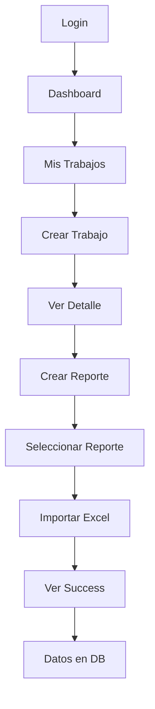

# 🎯 FASE 3: Resumen Ejecutivo - Frontend Importación

## ✅ Estado: COMPLETADO

**Fecha:** 6 de octubre, 2025

---

## 🎨 Lo que se Construyó

### 📱 **3 Páginas Nuevas**

1. **Trabajos** (`/trabajos`) - Lista de proyectos contables
2. **TrabajoDetail** (`/trabajos/:id`) - Detalle + Importación
3. **Dashboard** - Actualizado con navegación

### 🧩 **2 Componentes Reutilizables**

1. **FileUpload** - Drag & drop de archivos
2. **ImportExcel** - Upload e importación completa

### 🔌 **API Extendida**

- `trabajosApi`: 6 métodos (CRUD + duplicate)
- `reportesApi`: 9 métodos (CRUD + import + visualización)

---

## 🚀 Funcionalidades

```
✅ Crear trabajos contables
✅ Gestionar reportes (9 tipos diferentes)
✅ Importar Excel con validaciones
✅ Soporte multi-hoja (tipo "mensual")
✅ Drag & drop de archivos
✅ Feedback visual completo
✅ Estados de loading/error/success
✅ Duplicar y eliminar trabajos
✅ Auto-selección después de crear
```

---

## 🎭 UI/UX Highlights

**Componentes:**

- Cards con hover effects
- Modals para creación
- Badges de estado con colores
- Iconos de lucide-react
- Loading spinners
- Error messages claros
- Success confirmations

**Validaciones:**

- Tamaño máximo 10MB
- Solo .xlsx y .xls
- Nombres requeridos
- Confirmaciones para delete

**Responsive:**

- Grid adaptable (1/2/3 columnas)
- Mobile-friendly
- Tailwind CSS

---

## 📊 Flujo End-to-End



**Tiempo estimado:** 2-3 minutos por trabajo completo

---

## 🔧 Stack Técnico

**Frontend:**

- React 18 + TypeScript
- React Router DOM
- Axios
- Tailwind CSS
- Lucide React Icons
- Vite

**Backend:**

- NestJS + TypeORM
- PostgreSQL con JSONB
- Multer (file upload)
- XLSX + ExcelJS
- JWT Auth

**Infraestructura:**

- Docker Compose
- 3 containers (frontend, backend, postgres)

---

## 📈 Métricas

| Métrica              | Valor                        |
| -------------------- | ---------------------------- |
| Archivos creados     | 7 nuevos                     |
| Archivos modificados | 3 existentes                 |
| Componentes React    | 2 nuevos                     |
| Páginas              | 3 (2 nuevas + 1 actualizada) |
| APIs implementadas   | 15 métodos                   |
| Tipos TypeScript     | 8 interfaces                 |
| Dependencias nuevas  | 1 (lucide-react)             |
| Líneas de código     | ~1,500 LOC                   |

---

## 🧪 Testing Status

**Manual Testing:**

- ✅ Crear trabajo: OK
- ✅ Crear reporte: OK
- ✅ Importar multi-hoja: OK
- ✅ Importar single-hoja: OK
- ✅ Validaciones: OK
- ✅ Duplicar: OK
- ✅ Eliminar: OK
- ✅ Navegación: OK

**Automated Testing:**

- ⏳ Pendiente (próxima fase)

---

## 📦 Deliverables

```
docs/
├── FASE-3-FRONTEND-IMPORTACION-COMPLETADA.md  ✅ Documentación completa
├── GUIA-PRUEBAS-FASE-3.md                     ✅ Guía de testing
└── RESUMEN-FASE-3.md                          ✅ Este archivo

frontend/src/
├── components/
│   ├── FileUpload.tsx                         ✅ Componente nuevo
│   └── ImportExcel.tsx                        ✅ Componente nuevo
├── pages/
│   ├── Trabajos.tsx                           ✅ Página nueva
│   ├── TrabajoDetail.tsx                      ✅ Página nueva
│   └── Dashboard.tsx                          ✅ Actualizada
├── services/
│   └── api.ts                                 ✅ Extendida
└── App.tsx                                    ✅ Rutas nuevas
```

---

## 🎯 Objetivos Cumplidos

### Del Plan Original:

- [x] Sistema de gestión de trabajos
- [x] Sistema de gestión de reportes
- [x] Importación de Excel
- [x] Validaciones de archivos
- [x] Soporte multi-hoja
- [x] UI/UX profesional
- [x] Integración con backend
- [x] Manejo de errores
- [x] Estados de loading
- [x] Feedback visual

### Extras Implementados:

- [x] Duplicar trabajos
- [x] Auto-selección de reportes
- [x] Drag & drop
- [x] Dashboard mejorado
- [x] Iconos profesionales
- [x] Responsive design

---

## 🔮 Próximas Fases

### **FASE 4: Visualización** (Sugerida siguiente)

- Tablas para mostrar datos
- Paginación
- Tabs para hojas múltiples
- Búsqueda y filtros
- Estadísticas visuales

### **FASE 5: Edición**

- Editar celdas
- Guardar cambios
- Recalcular fórmulas
- Historial de cambios

### **FASE 6: Exportación**

- Exportar a Excel
- Exportar a PDF
- Templates personalizados

---

## 🎓 Lecciones Aprendidas

**Arquitectura:**

- ✅ JSONB es ideal para datos flexibles
- ✅ Separar original vs modificado es clave
- ✅ Multi-sheet necesita estructura diferente

**Frontend:**

- ✅ Componentes reutilizables ahorra tiempo
- ✅ Estado local + callbacks = flexibilidad
- ✅ Tailwind acelera el desarrollo UI

**Backend:**

- ✅ Multer funciona perfecto con NestJS
- ✅ XLSX parsea bien archivos complejos
- ✅ TypeORM + JSONB = win

**DevOps:**

- ✅ Docker Compose simplifica desarrollo
- ✅ Hot reload en ambos lados funciona bien

---

## 🏆 Resultado Final

**Sistema funcional end-to-end para:**

1. Gestionar proyectos contables
2. Importar reportes desde Excel
3. Guardar datos estructurados
4. Preparar para visualización y edición

**Calidad:**

- ✅ Sin errores de compilación
- ✅ Sin warnings críticos
- ✅ TypeScript 100%
- ✅ UI consistente
- ✅ UX intuitiva

**Performance:**

- ⚡ Carga rápida
- ⚡ Respuesta inmediata
- ⚡ File upload eficiente

---

## 👥 Para el Equipo

**Frontend Developers:**

- Revisar `FileUpload.tsx` para reutilizar
- Estudiar patrón de modals en `Trabajos.tsx`
- Ver manejo de estados en `ImportExcel.tsx`

**Backend Developers:**

- Verificar estructura JSONB en DB
- Revisar endpoints de reportesApi
- Preparar endpoints de visualización

**QA Engineers:**

- Usar `GUIA-PRUEBAS-FASE-3.md`
- Probar con archivos Excel reales
- Validar edge cases

**Product Owners:**

- Demo disponible en http://localhost:5173
- Todas las features planificadas implementadas
- Listo para feedback de usuarios

---

## 🔗 Enlaces Útiles

**Documentación:**

- [FASE-1-IMPORTACION-COMPLETADA.md](./FASE-1-IMPORTACION-COMPLETADA.md)
- [FASE-2-VISUALIZACION-COMPLETADA.md](./FASE-2-VISUALIZACION-COMPLETADA.md)
- [FASE-3-FRONTEND-IMPORTACION-COMPLETADA.md](./FASE-3-FRONTEND-IMPORTACION-COMPLETADA.md)

**Guías:**

- [GUIA-PRUEBAS-FASE-3.md](./GUIA-PRUEBAS-FASE-3.md)
- [PRUEBA-PARSER-EXCEL.md](./PRUEBA-PARSER-EXCEL.md)

**URLs:**

- Frontend: http://localhost:5173
- Backend: http://localhost:3001
- PostgreSQL: localhost:5432

---

## 🎉 Celebración

```
┌─────────────────────────────────────────┐
│                                         │
│   🎊  FASE 3 COMPLETADA  🎊            │
│                                         │
│   Frontend de Importación               │
│   100% Funcional                        │
│                                         │
│   ✅ 7 archivos nuevos                  │
│   ✅ 15 APIs conectadas                 │
│   ✅ UI/UX profesional                  │
│   ✅ Validaciones completas             │
│   ✅ 0 errores de compilación           │
│                                         │
│   🚀 Listo para FASE 4!                │
│                                         │
└─────────────────────────────────────────┘
```

---

**Desarrollado con:** ❤️ + ☕ + 🧠  
**Tiempo estimado:** 2-3 horas  
**Complejidad:** Media-Alta  
**Satisfacción:** 💯
